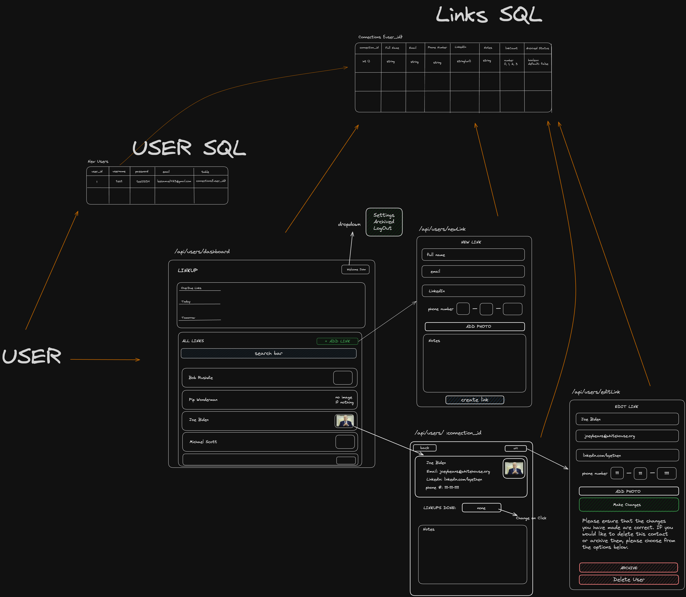
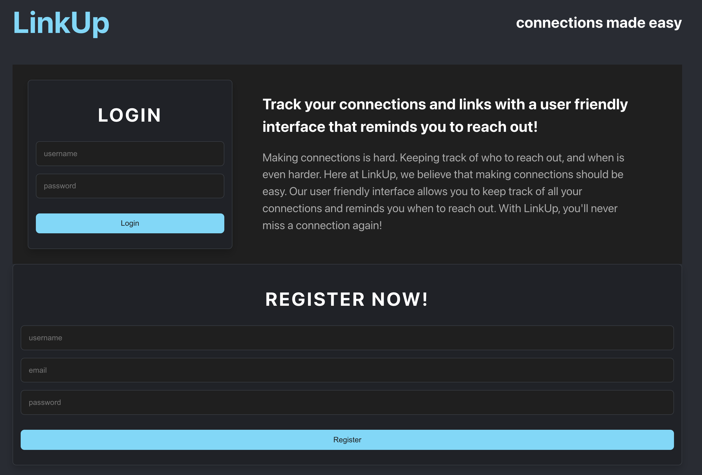
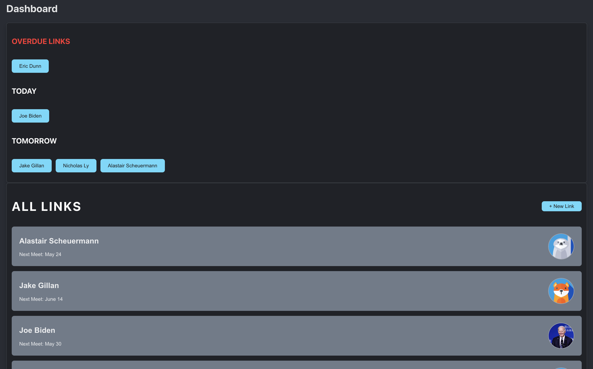
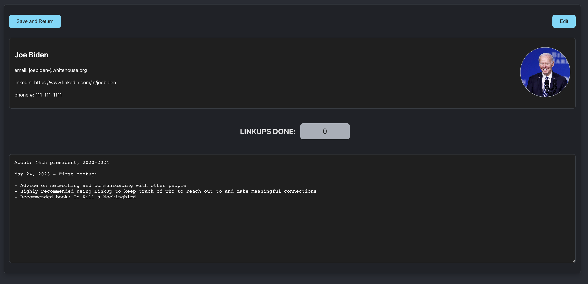
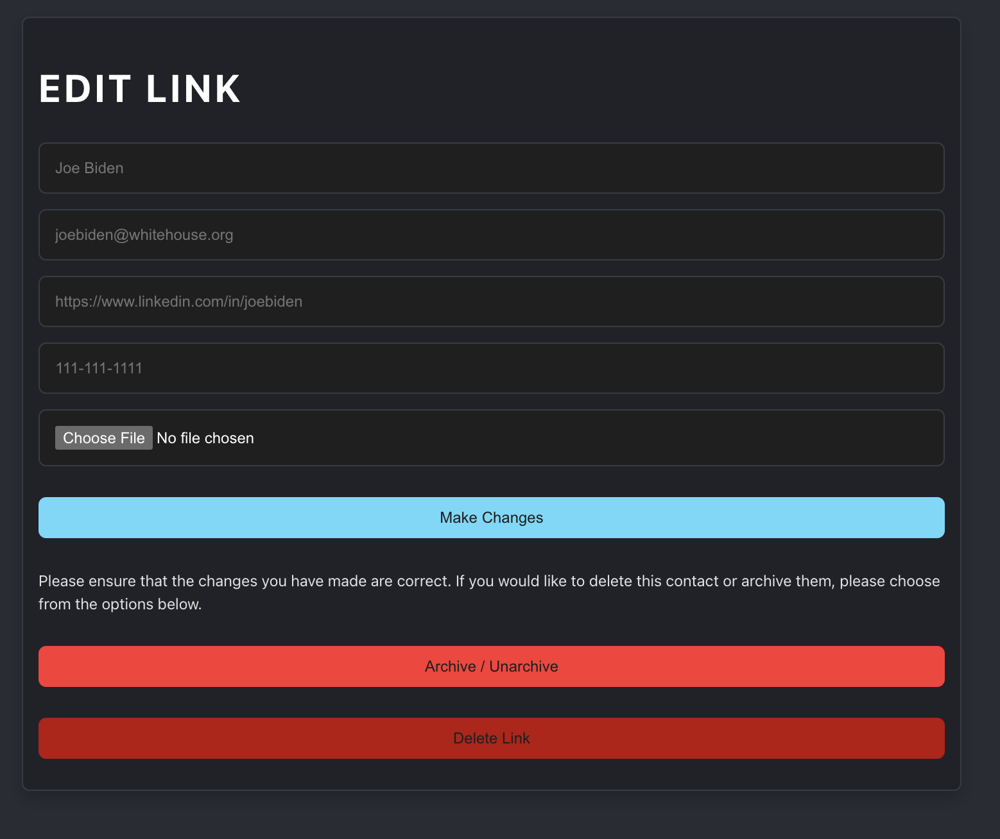

# LinkUp - Connections Made Easy

## Introduction
LinkUp is a project aimed at helping people track and maintain their professional and personal connections effectively. In today's world, where networking plays a pivotal role, it's easy to lose track of who to reach out to and when. LinkUp solves this issue by providing a user-friendly interface to manage your connections, and reminding you to reach out at appropriate times.  








## Features
LinkUp provides a simple yet powerful platform to:

* Login securely and maintain your individual profile.
* Register to join the LinkUp community.
* Keep track of all your connections in a centralized place.
* Get timely reminders to reach out, so you never miss an opportunity.
* Navigate through an intuitive and aesthetically pleasing interface.

## Getting Started
To start using LinkUp, simply clone this repository, install dependencies, and start the server.

```bash
# Clone this repository
git clone https://github.com/yourUsername/LinkUp.git

# Go into the repository
cd LinkUp

# Install dependencies
npm install

# Start the server
npm start

```

## Contributing
Feel free to submit a pull request if you want to contribute to this project. We always appreciate contributions from the community!

## License
This project is open source and available under the [MIT License](https://opensource.org/license/mit/).


